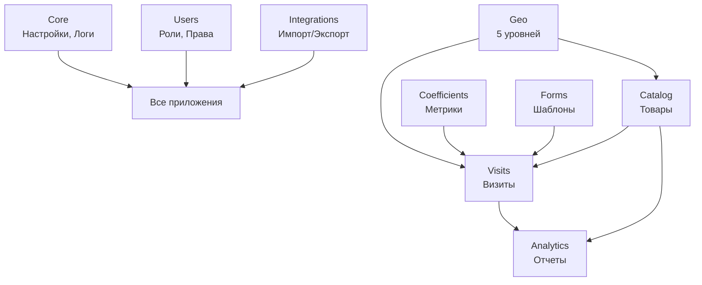

# DATUM - Архитектура и Функционал

**Версия:** 1.0
**Дата:** 2025-11-30
**Django версия:** 5.2.7
**База данных:** SQLite

---

## Содержание

1. [Обзор системы](#обзор-системы)
2. [Архитектура проекта](#архитектура-проекта)
3. [Django приложения](#django-приложения)
4. [Модели данных](#модели-данных)
5. [Реализованный функционал](#реализованный-функционал)
6. [Особенности реализации](#особенности-реализации)
7. [API и AJAX](#api-и-ajax)
8. [Frontend и UI](#frontend-и-ui)
9. [Текущее состояние](#текущее-состояние)

---

## Обзор системы

DATUM - это комплексная система для управления Mystery Shopping (тайными покупками), сбора данных в розничных точках и аналитики. Система поддерживает как веб-интерфейс, так и мобильное приложение (PWA).

### Основные возможности

- **Управление визитами** - планирование, выполнение и контроль визитов тайных покупателей
- **Сбор данных** - замеры коэффициентов, фото/видео фиксация, GPS-координаты
- **Каталог товаров** - гибкая EAV система для любых типов товаров
- **Гео-структура** - 5-уровневая иерархия (Мир → Страна → Регион → Канал → Точка)
- **Аналитика** - коэффициенты, метрики, формулы, отчеты
- **Интеграции** - импорт/экспорт данных в различных форматах

### Ключевые особенности

- ✅ **EAV система** - создание любых атрибутов товаров без изменения БД
- ✅ **Типы данных** - разделение мониторинговых, экспертных и AI данных
- ✅ **PWA Ready** - работает как мобильное приложение
- ✅ **Оффлайн режим** - Background Sync API для работы без интернета
- ✅ **Ролевая система** - 4 роли с гибкими правами доступа
- ✅ **Audit Trail** - полное логирование всех изменений
- ✅ **Мобильная оптимизация** - отдельные интерфейсы для смартфонов

---

## Архитектура проекта

### Структура Django приложений

```
datum_project/
├── core/              # Ядро системы (настройки, логи, константы)
├── users/             # Пользователи и права доступа
├── geo/               # 5-уровневая геоструктура
├── catalog/           # Каталог товаров с EAV системой
├── coefficients/      # Коэффициенты, метрики, формулы
├── visits/            # Визиты и наблюдения
├── forms/             # Динамические формы
├── analytics/         # Дашборды и отчеты
├── integrations/      # Импорт/экспорт, бэкапы
└── api/               # AJAX endpoints
```

### Взаимосвязи приложений



---

## Django приложения

### 1. CORE - Ядро системы

**Назначение:** Базовые настройки, логирование, константы

**Модели:**
- `SystemSettings` - глобальные настройки (singleton pattern)
- `IntegrationSettings` - настройки внешних систем (1C, Google Sheets)
- `SystemLog` - лог событий системы
- `AuditLog` - аудит всех изменений (old/new values в JSON)

**Ключевые файлы:**
- `constants.py` - DATA_SOURCE_CHOICES, FORMULA_SOURCE_CHOICES
- `validation.py` - классы валидаторов для всех моделей

**Статус:** ✅ Полностью реализовано

---

### 2. USERS - Пользователи и права

**Назначение:** Управление пользователями, ролями и правами доступа

**Модели:**
- `User` - кастомная модель пользователя (расширяет AbstractUser)
  - Поля: phone, position, organization, avatar, language
- `Role` - роли пользователей
  - 4 роли: Admin, Analyst, Expert, Inspector
- `Permission` - права доступа к модулям
  - CRUD права с уровнями данных (MON/EXP/BOTH)
- `UserSession` - отслеживание активных сессий
  - IP адрес, User-Agent, дата входа/выхода

**Функционал:**
- Кастомная авторизация (AUTH_USER_MODEL = 'users.User')
- Ролевая система с гибкими правами
- CRUD для пользователей и ролей
- Отслеживание сессий

**Статус:** ✅ Полностью реализовано

---

### 3. GEO - Географическая структура

**Назначение:** 5-уровневая иерархия торговых точек

**Модели (5 уровней):**

1. **GlobalMarket** - Глобальный рынок (весь мир)
   - Валюта, единицы измерения, тип данных по умолчанию

2. **Country** - Страна
   - ISO код, флаг (изображение), валюта, телефонный код

3. **Region** - Регион
   - Тип данных (MON/EXP/AI), geo_polygon (JSON для GeoJSON)

4. **Channel** - Канал сбыта
   - Типы: Розница, Опт, Онлайн, HoReCa

5. **Outlet** - Точка сбыта (розничная точка)
   - GPS координаты, адрес, телефон, email
   - График работы, фото, менеджер
   - Статусы: active, inactive, closed

**Дополнительные модели:**
- `FootfallCounter` - проходимость точки (дневной трафик)
- `Display` - витрины/прилавки в точке
- `DisplayInventory` - товары на конкретной витрине
- `OutletInventory` - наличие товаров в точке

**Функционал:**
- Полный CRUD для всех 5 уровней
- Каскадные селекты через AJAX (см. раздел API)
- OutletQuickAddView - быстрое добавление точки с мобильного
- Validation при создании/обновлении
- Фильтрация по статусам, каналам, регионам

**URL patterns:** 42 endpoint

**Статус:** ✅ Полностью реализовано

---

### 4. CATALOG - Каталог товаров

**Назначение:** Управление товарами с гибкой системой атрибутов (EAV)

**Базовые модели:**
- `Brand` - Бренды
  - Логотип, страна производства, описание
- `Category` - Категории товаров
  - Иерархическая структура (parent ForeignKey)
- `Product` - Товары
  - SKU код, вес, цена, изображение
  - Статусы: draft, active, inactive, discontinued

**EAV система (Entity-Attribute-Value):**

**Модели:**
- `AttributeGroup` - группы атрибутов
  - Связь с категорией, порядок сортировки

- `AttributeDefinition` - определения атрибутов
  - 8 типов данных: text, integer, decimal, boolean, date, choice, multi_choice, file
  - Валидация: min_value, max_value, max_length, required
  - Дополнительно: unit, placeholder, help_text
  - Флаги: is_filterable, is_searchable, is_active

- `ProductAttributeValue` - значения атрибутов товара
  - 8 полей для разных типов: value_text, value_integer, value_decimal, value_boolean, value_date, value_choice, value_multi_choice, value_file
  - Связь: Product + AttributeDefinition

- `CategoryAttributeTemplate` - шаблоны атрибутов для категорий
  - Какие атрибуты обязательны для категории
  - Порядок отображения

**Функционал:**
- CRUD для Brand/Category/Product
- CRUD для AttributeGroup/AttributeDefinition
- ProductCreateView/UpdateView с динамическими атрибутами
- ProductListView с фильтрацией по атрибутам
- AJAX endpoint: get_category_attributes (атрибуты для категории)
- Preinstall система:
  - preinstall_list - список предустановленных категорий
  - preinstall_load - загрузка категории из JSON
  - PreinstallLoader класс (jewelry.json, pasta.json, detergents.json)

**URL patterns:** 30+ endpoints

**Статус:** ✅ Полностью реализовано

---

### 5. COEFFICIENTS - Коэффициенты и метрики

**Назначение:** Система показателей для измерений и аналитики

**Модели:**

**Coefficient** - коэффициент (базовый показатель)
- Типы данных: MON (мониторинговые), EXP (экспертные), AI (данные ИИ)
- Применимость к уровням geo:
  - applies_to_outlet, applies_to_channel, applies_to_region, applies_to_country, applies_to_global
- Типы значений: numeric, text, boolean
- Единицы измерения (unit): штук, кг, %, см, м² и т.д.
- Статус: is_active

**Metric** - метрика (готовый показатель)
- Категории: distribution, price, share, availability, other
- source_data_type: MON/EXP/AI/CUSTOM (какой тип данных использовать)
- Связь с Coefficient (ManyToMany)
- Связь с Formula (ForeignKey)

**Formula** - формула расчета
- Выражение: expression (например: "(C1 + C2) / C3 * 100")
- source_data_type: MON/EXP/AI/CUSTOM
- Связь с Coefficient (ManyToMany)
- Типы результата: numeric, percentage, boolean
- Единица измерения результата

**Rule** - правило обработки данных
- Типы правил: aggregation, validation, transformation
- Методы агрегации: sum, avg, min, max, count
- Применимость к коэффициентам (ManyToMany)
- Параметры в JSON

**Функционал:**
- CRUD для всех моделей
- coefficients_api - API для визуального конструктора
- Фильтрация по типам данных
- Группировка по категориям

**URL patterns:** ~20 endpoints

**Статус:** ✅ Полностью реализовано

---

### 6. VISITS - Визиты и наблюдения

**Назначение:** Управление визитами тайных покупателей и сбор данных

**Модели:**

**VisitType** - тип визита (шаблон)
- Название, описание, требования
- Коэффициенты для замера (ManyToMany с Coefficient)
- Требования: photo_required, gps_required, signature_required
- Form template (ForeignKey к FormTemplate)

**Visit** - визит
- Связи: outlet, user, visit_type
- Статусы: planned, in_progress, completed, cancelled
- Даты: planned_date, start_date, end_date
- GPS координаты: latitude, longitude
- form_data - JSON для динамических форм
- Подпись: signature (ImageField)
- Типы данных: data_source_type (MON/EXP/AI)

**Observation** - наблюдение (замер коэффициента)
- Связи: visit, coefficient, product (опционально)
- 3 типа значений: value_numeric, value_text, value_boolean
- data_source_type: MON/EXP/AI (как было получено значение)
- notes, metadata (JSON)

**VisitMedia** - медиа файлы визита
- Типы: photo, video, audio, document
- GPS из EXIF: latitude, longitude
- EXIF данные (JSON)
- Описание, временная метка

**Sale** - продажи
- Связи: visit, product
- Количество, цена, сумма (авто-расчет)
- Комментарии

**Функционал:**
- CRUD для всех моделей
- **my_visits** - интерфейс тайного покупателя (список своих визитов)
- **fill_visit** - заполнение визита (desktop/mobile версии)
- **start_visit_now** - мобильный быстрый старт
- **quick_start_visit** - быстрое создание визита
- **sync_visit_api** - Background Sync API для оффлайн режима
- **is_mobile** - определение типа устройства
- Validation: VisitValidator, ObservationValidator
- Фильтрация по статусам, пользователям, точкам
- Экспорт в Excel

**URL patterns:** ~30 endpoints

**Статус:** ✅ Полностью реализовано

---

### 7. FORMS - Динамические формы

**Назначение:** Конструктор форм для визитов и опросов

**Модели:**

**FormTemplate** - шаблон формы
- Типы: visit, survey, audit, report
- schema - JSON схема формы
- Статусы: draft, active, archived
- Версия формы (версионирование)
- Применимость к каналам (ManyToMany с Channel)

**Пример JSON схемы:**
```json
{
  "fields": [
    {
      "name": "store_cleanliness",
      "type": "rating",
      "label": "Чистота магазина",
      "required": true,
      "min": 1,
      "max": 5
    },
    {
      "name": "photo",
      "type": "image",
      "label": "Фото витрины",
      "required": true
    }
  ]
}
```

**Функционал:**
- Модель полностью реализована
- Templates созданы (list/detail/form)
- ⚠️ Views и Forms НЕ созданы
- Используется в visits через поле form_data (JSON)

**Статус:** ⚠️ Частично реализовано (модель готова, UI нет)

---

### 8. ANALYTICS - Аналитика и отчеты

**Назначение:** Дашборды, отчеты, прогнозирование

**Модели:**

**Dashboard** - дашборд
- Типы: overview, distribution, sales, custom
- widgets - JSON конфигурация виджетов
- filters - JSON фильтры
- Владелец (пользователь)
- Публичный/приватный

**Report** - отчет
- Связь с ReportTemplate
- Параметры (JSON)
- Форматы: html, pdf, excel, csv
- Статусы: pending, processing, completed, failed
- file_path - путь к сгенерированному файлу

**ReportTemplate** - шаблон отчета
- query - SQL запрос для выборки данных
- config - JSON конфигурация (графики, таблицы)
- Применимость к каналам

**FilterPreset** - сохраненные фильтры
- Модуль (visits, products, outlets)
- filters - JSON фильтры
- Публичный/приватный

**ForecastModel** - модель прогнозирования
- Типы: linear, exponential, seasonal, arima
- Связь с Metric
- Параметры (JSON)
- accuracy_score - точность модели

**Функционал:**
- Модели полностью реализованы
- Templates созданы (17 шаблонов)
- ⚠️ Views НЕ созданы
- ⚠️ Forms НЕ созданы
- ⚠️ Логика генерации отчетов НЕ реализована
- ⚠️ ML для прогнозирования НЕ подключен

**Статус:** ⚠️ Частично реализовано (только модели и шаблоны)

---

### 9. INTEGRATIONS - Интеграции

**Назначение:** Импорт/экспорт данных, бэкапы

**Модели:**

**ImportJob** - задание на импорт
- Источники: file, api, database, onec, google_sheets
- Форматы: csv, excel, json, xml
- Маппинг полей (JSON)
- Статусы: pending, processing, completed, failed
- Статистика: total_records, success_count, error_count

**ExportJob** - задание на экспорт
- Модель для экспорта (visits, products, outlets)
- Форматы: csv, excel, json, xml
- Фильтры (JSON)
- file_path - путь к файлу

**Backup** - бэкап
- Типы: full, incremental, differential
- Статусы: pending, in_progress, completed, failed
- checksum - контрольная сумма
- file_path, size

**Функционал:**
- Модели полностью реализованы
- ⚠️ Views НЕ созданы
- ⚠️ Forms НЕ созданы
- ⚠️ Templates НЕ созданы
- ⚠️ Логика импорта/экспорта НЕ реализована
- ⚠️ Логика бэкапов НЕ реализована

**Статус:** ⚠️ Частично реализовано (только модели)

---

## Модели данных

### Типы данных (DATA_SOURCE)

Система разделяет данные по источникам:

**MON (Мониторинговые)** 🔵
- Данные, полученные через замеры в полях
- Используется в: Coefficient, Visit, Observation
- Цвет: primary (синий)
- Иконка: bi-rulers (линейка)

**EXP (Экспертные)** 🟢
- Данные от экспертов, интервью, оценки
- Используется в: Coefficient, Visit, Observation
- Цвет: success (зеленый)
- Иконка: bi-person-badge

**AI (Данные ИИ)** 🟣
- Данные, полученные через анализ ИИ
- Заготовка для будущего ML функционала
- Цвет: purple (#6f42c1)
- Иконка: bi-cpu (процессор)

**CUSTOM (Смешанные)** 🟡
- Только для Formula и Metric
- Комбинация разных типов данных
- Цвет: warning (желтый)
- Иконка: bi-gear (шестеренка)

### Иерархии

**Гео-структура:**
```
GlobalMarket (1)
  └─ Country (N)
      └─ Region (N)
          └─ Channel (N)
              └─ Outlet (N)
```

**Каталог:**
```
Brand (N) ───┐
             ├─ Product (N)
Category (N) ┘      │
                    └─ ProductAttributeValue (N)
                            │
AttributeGroup (N) ──┐      │
                     ├─ AttributeDefinition (N)
Category (N) ────────┘
```

**Визиты:**
```
VisitType (1)
  ├─ Coefficient (N) - какие коэффициенты замерять
  └─ FormTemplate (1) - какую форму использовать

Visit (N)
  ├─ Outlet (1)
  ├─ User (1)
  ├─ VisitType (1)
  ├─ Observation (N) - замеры коэффициентов
  ├─ VisitMedia (N) - фото/видео
  └─ Sale (N) - продажи
```

### Индексы БД

Созданы индексы для оптимизации запросов:

**visits.Observation:**
- `[visit, coefficient]` - быстрая выборка наблюдений визита
- `[coefficient, product]` - фильтрация по коэффициенту и товару

**visits.Visit:**
- `[outlet, -created_at]` - визиты точки (новые первые)
- `[user, -created_at]` - визиты пользователя
- `[status]` - фильтрация по статусу

**coefficients.Coefficient:**
- `[code]` - поиск по коду
- `[data_type]` - фильтрация по типу

**core.AuditLog:**
- `[table_name, record_id]` - история записи
- `[-timestamp]` - последние изменения первыми

---

## Реализованный функционал

### ✅ Полностью работает

**Управление пользователями:**
- Регистрация, авторизация, профиль
- 4 роли: Admin, Analyst, Expert, Inspector
- Права доступа к модулям с уровнями данных
- Отслеживание сессий

**Гео-структура:**
- CRUD для всех 5 уровней
- Каскадные селекты (AJAX)
- Быстрое добавление точки
- Управление витринами и наличием товаров

**Каталог товаров:**
- CRUD для брендов, категорий, товаров
- EAV система с 8 типами атрибутов
- Фильтрация и поиск по атрибутам
- Preinstall система (загрузка предустановленных категорий)

**Коэффициенты и метрики:**
- CRUD для коэффициентов, метрик, формул, правил
- Применимость к уровням гео-структуры
- Разделение по типам данных (MON/EXP/AI)
- API для конструктора

**Визиты:**
- Планирование и выполнение визитов
- Мобильный интерфейс для тайного покупателя
- Заполнение визитов (desktop/mobile)
- Замеры коэффициентов (наблюдения)
- Фото/видео фиксация
- GPS координаты
- Подпись
- Оффлайн режим (Background Sync API)
- Экспорт в Excel

**Система логирования:**
- SystemLog - события системы
- AuditLog - все изменения данных (old/new values)

### ⚠️ Частично работает

**Динамические формы:**
- ✅ Модель FormTemplate реализована
- ✅ JSON схема форм
- ❌ UI конструктора форм не создан
- ✅ Используется через form_data в visits

**Аналитика:**
- ✅ Модели Dashboard, Report, ReportTemplate
- ✅ Шаблоны интерфейса созданы
- ❌ Views и Forms не реализованы
- ❌ Генерация PDF отчетов не подключена
- ❌ ML для прогнозирования не подключен

**Интеграции:**
- ✅ Модели ImportJob, ExportJob, Backup
- ❌ Views, Forms, Templates не созданы
- ❌ Логика импорта/экспорта не реализована
- ❌ Логика бэкапов не реализована
- ❌ Интеграция с 1C не реализована
- ❌ Интеграция с Google Sheets не реализована

### ❌ Заглушки / TODO

**Geo:**
- geo_polygon в Region - поле есть, GeoJSON не используется
- GPS из EXIF - поле есть, парсинг не реализован

**Visits:**
- EXIF данные из фото - поле есть, извлечение не реализовано

**Analytics:**
- Визуальный конструктор дашбордов - только API
- PDF генерация - шаблон есть, библиотека не подключена
- ML прогнозирование - модель есть, алгоритмы нет

**Integrations:**
- Вся логика импорта/экспорта
- Вся логика бэкапов
- Все внешние интеграции

---

## Особенности реализации

### EAV система (Entity-Attribute-Value)

**Зачем нужна:**
Позволяет создавать атрибуты товаров без изменения структуры БД. Например, для ювелирных изделий нужны атрибуты "проба металла", "тип камня", а для продуктов питания - "вес", "калорийность".

**Как работает:**

1. **AttributeDefinition** - определение атрибута
   - Название: "Проба металла"
   - Тип: choice
   - Варианты: ["585", "750", "925"]

2. **ProductAttributeValue** - значение для товара
   - Product: "Кольцо золотое"
   - AttributeDefinition: "Проба металла"
   - value_choice: "585"

**8 типов атрибутов:**
- `text` - текст (value_text, max_length)
- `integer` - целое число (value_integer, min/max)
- `decimal` - дробное число (value_decimal, min/max)
- `boolean` - да/нет (value_boolean)
- `date` - дата (value_date)
- `choice` - выбор из списка (value_choice, choices JSON)
- `multi_choice` - множественный выбор (value_multi_choice, choices JSON)
- `file` - файл (value_file)

**Валидация:**
- min_value, max_value - для numeric типов
- max_length - для text
- required - обязательность
- choices - список вариантов для choice типов

**Группировка:**
AttributeGroup позволяет организовать атрибуты:
- "Металл" → проба, цвет, вес
- "Камни" → тип, количество, огранка

**Шаблоны для категорий:**
CategoryAttributeTemplate определяет, какие атрибуты обязательны для категории:
- Категория "Кольца" → обязательны: проба, размер, вес

### Система типов данных

**Разделение данных по источникам:**

**Принцип:** Мониторинговые и экспертные данные НЕ смешиваются при расчетах.

**Примеры использования:**

1. **Коэффициент "Цена товара"**
   - data_type = MON (обычно измеряется)
   - Но может иметь наблюдения:
     - Observation 1: value=150₽, data_source_type=MON (измерили)
     - Observation 2: value=145₽, data_source_type=EXP (оценка эксперта)

2. **Формула "Средняя цена по мониторингу"**
   - source_data_type = MON
   - При расчете использует ТОЛЬКО наблюдения с data_source_type=MON

3. **Формула "Средняя цена по всем данным"**
   - source_data_type = CUSTOM
   - Использует ВСЕ наблюдения (MON + EXP + AI)

**Где используется:**
- Coefficient.data_type - тип коэффициента
- Formula.source_data_type - какие данные использовать
- Metric.source_data_type - какие данные использовать
- Visit.data_source_type - тип визита
- Observation.data_source_type - как получено значение

**Визуализация:**
- MON: синий бейдж с иконкой линейки
- EXP: зеленый бейдж с иконкой эксперта
- AI: фиолетовый бейдж с иконкой процессора
- CUSTOM: желтый бейдж с иконкой шестеренки

### Мобильный интерфейс

**Определение устройства:**
```python
def is_mobile(request):
    user_agent = request.META.get('HTTP_USER_AGENT', '').lower()
    return any(device in user_agent for device in ['mobile', 'android', 'iphone'])
```

**Отдельные шаблоны:**
- fill_visit.html - desktop версия
- fill_visit_mobile.html - мобильная версия
- start_visit_now.html - быстрый старт с мобильного

**Оффлайн режим:**
- Background Sync API (sync_visit_api)
- Service Worker (service-worker.js)
- Кеширование запросов
- Автоматическая синхронизация при появлении сети

**PWA (Progressive Web App):**
- manifest.json - конфигурация приложения
- icons/ - иконки разных размеров
- service-worker.js - кеширование и оффлайн
- offline.html - страница без интернета

### Validation система

**Где используется:**
- OutletValidator - валидация точек
- VisitValidator - валидация визитов
- ObservationValidator - валидация наблюдений

**Пример OutletValidator:**
```python
class OutletValidator:
    @staticmethod
    def validate_gps(latitude, longitude):
        if not (-90 <= latitude <= 90):
            raise ValidationError("Широта должна быть от -90 до 90")
        if not (-180 <= longitude <= 180):
            raise ValidationError("Долгота должна быть от -180 до 180")
```

**ValidationMessage:**
Класс для унифицированных сообщений об ошибках с уровнями:
- ERROR - критическая ошибка
- WARNING - предупреждение
- INFO - информация

---

## API и AJAX

### AJAX endpoints (api/ajax_views.py)

**Каскадные селекты для гео-структуры:**

1. `ajax_countries_by_globalmarket` - страны по глобальному рынку
   - GET: ?globalmarket_id=1
   - Формат: Select2 compatible

2. `ajax_regions_by_country` - регионы по стране
   - GET: ?country_id=1

3. `ajax_channels_by_region` - каналы по региону
   - GET: ?region_id=1

4. `ajax_outlets_by_channel` - точки по каналу
   - GET: ?channel_id=1

**Каскадные селекты для каталога:**

5. `ajax_products_by_brand` - товары по бренду
   - GET: ?brand_id=1

6. `ajax_products_by_category` - товары по категории
   - GET: ?category_id=1

**Атрибуты товаров:**

7. `get_category_attributes` - атрибуты для категории
   - GET: ?category_id=1
   - Возвращает: список атрибутов с группами

**Статистика:**

8. `ajax_outlet_stats` - статистика по точке
   - GET: ?outlet_id=1
   - Возвращает: количество визитов, последний визит, средние показатели

**Формат ответа (Select2 compatible):**
```json
{
  "results": [
    {
      "id": 1,
      "text": "Название",
      "...": "дополнительные поля"
    }
  ],
  "pagination": {
    "more": false
  }
}
```

### REST API endpoints (coefficients)

**coefficients_api** - для визуального конструктора
- Список всех коэффициентов
- Группировка по типам
- Применимость к уровням

---

## Frontend и UI

### Шаблоны (Templates)

**Базовый шаблон:** base.html
- Bootstrap 5
- Bootstrap Icons
- Navbar с навигацией
- Sidebar (опционально)
- Messages система
- Footer

**Созданные шаблоны:**

**Analytics (17):**
- dashboard_list/detail/form/confirm_delete
- report_list/detail/form/confirm_delete/pdf
- reporttemplate_list/detail/form/confirm_delete
- filterpreset_list/detail/form/confirm_delete

**Catalog (30+):**
- brand_list/detail/form/confirm_delete
- category_list/detail/form/confirm_delete
- product_list/detail/form/confirm_delete
- attributegroup_list/detail/form
- attributedefinition_list/detail/form
- preinstall_list

**Geo (20+):**
- globalmarket_list/detail/form/confirm_delete
- country_list/detail/form/confirm_delete
- region_list/detail/form/confirm_delete
- channel_list/detail/form/confirm_delete
- outlet_list/detail/form/confirm_delete/quick_add

**Visits (15+):**
- visittype_list/detail/form/confirm_delete
- visit_list/detail/form/confirm_delete
- observation_list/detail/form/confirm_delete
- visitmedia_list/detail/form/confirm_delete
- my_visits, fill_visit, fill_visit_mobile, start_visit_now

**Coefficients (16):**
- coefficient_list/detail/form/confirm_delete
- metric_list/detail/form/confirm_delete
- formula_list/detail/form/confirm_delete
- rule_list/detail/form/confirm_delete

**Forms (4):**
- formtemplate_list/detail/form/confirm_delete

**Users (8):**
- user_list/detail/form/confirm_delete
- role_list/detail/form/confirm_delete

**Общие (3):**
- home.html - главная страница
- offline.html - страница без интернета
- registration/login.html - авторизация

### JavaScript

**Библиотеки:**
- Bootstrap 5.x
- Select2 (каскадные селекты)

**Кастомный JS:**
- service-worker.js (9KB) - PWA функционал
- Встроенные скрипты в шаблонах для:
  - Каскадных селектов
  - Динамических форм атрибутов
  - Background Sync API

### CSS/Стили

**Bootstrap 5** с кастомизацией:
- Цветовая схема для типов данных
- Адаптивная верстка
- Мобильная оптимизация

**Иконки:**
- Bootstrap Icons (bi-*)
- Иконки для типов данных
- Иконки для действий (edit, delete, view)

---

## Текущее состояние

### Статистика проекта

**Код:**
- 271 файл
- ~38,000 строк кода
- 9 Django приложений
- ~100 моделей БД

**Миграции:**
- Все созданы и применены
- SQLite база данных

**Функционал:**

| Модуль | Модели | Views | Forms | Templates | API | Статус |
|--------|--------|-------|-------|-----------|-----|--------|
| core | ✅ | ✅ | ✅ | ✅ | ✅ | 100% |
| users | ✅ | ✅ | ✅ | ✅ | ✅ | 100% |
| geo | ✅ | ✅ | ✅ | ✅ | ✅ | 100% |
| catalog | ✅ | ✅ | ✅ | ✅ | ✅ | 100% |
| coefficients | ✅ | ✅ | ✅ | ✅ | ✅ | 100% |
| visits | ✅ | ✅ | ✅ | ✅ | ✅ | 100% |
| forms | ✅ | ❌ | ❌ | ✅ | ❌ | 40% |
| analytics | ✅ | ❌ | ❌ | ✅ | ❌ | 50% |
| integrations | ✅ | ❌ | ❌ | ❌ | ❌ | 20% |

**Общая готовность:** ~70%

### Что работает на 100%

1. ✅ **Система пользователей** - авторизация, роли, права
2. ✅ **Гео-структура** - 5 уровней, каскады, витрины
3. ✅ **Каталог товаров** - бренды, категории, товары
4. ✅ **EAV система** - 8 типов атрибутов, группы, шаблоны
5. ✅ **Коэффициенты** - коэффициенты, метрики, формулы, правила
6. ✅ **Визиты** - полный workflow от планирования до завершения
7. ✅ **Наблюдения** - замеры коэффициентов с типами данных
8. ✅ **Мобильный интерфейс** - PWA, оффлайн, GPS
9. ✅ **AJAX API** - каскадные селекты, статистика
10. ✅ **Validation** - валидаторы для всех моделей
11. ✅ **Audit Trail** - логирование всех изменений

### Что требует доработки

**Forms приложение (40% готовности):**
- ✅ Модель FormTemplate реализована
- ✅ Templates созданы
- ❌ Views не созданы
- ❌ Forms не созданы
- ❌ UI конструктора форм не реализован
- **Оценка работы:** 2-3 дня

**Analytics приложение (50% готовности):**
- ✅ Все модели реализованы
- ✅ Templates созданы (17 шаблонов)
- ❌ Views не созданы
- ❌ Forms не созданы
- ❌ Логика генерации отчетов не реализована
- ❌ PDF генерация не подключена (weasyprint)
- ❌ ML для прогнозирования не подключено
- **Оценка работы:** 1-2 недели

**Integrations приложение (20% готовности):**
- ✅ Модели реализованы
- ❌ Views не созданы
- ❌ Forms не созданы
- ❌ Templates не созданы
- ❌ Логика импорта CSV/Excel не реализована
- ❌ Логика экспорта не реализована
- ❌ Логика бэкапов не реализована
- ❌ Интеграция с 1C не реализована
- ❌ Интеграция с Google Sheets не реализована
- **Оценка работы:** 2-3 недели

**Дополнительные улучшения:**
- ❌ EXIF парсинг из фото (GPS, дата)
- ❌ GeoJSON для отображения регионов на карте
- ❌ REST API (DRF) для мобильных приложений
- ❌ WebSocket для real-time обновлений
- ❌ Celery для фоновых задач
- **Оценка работы:** 1-2 недели

### Management команды

**Созданные команды:**

1. **setup_fonon** ✅
   - Настройка системы для ювелирной розницы FONON
   - Создает полную структуру:
     - GlobalMarket "Мир"
     - Country "Россия"
     - Region "Москва"
     - Channel "Розничная сеть"
     - 6 категорий ювелирных изделий
     - 2 группы атрибутов (Металл, Камни)
     - 27 коэффициентов
     - 10 формул
     - 10 метрик
     - FormTemplate для визитов

2. **create_fonon_dashboard**
   - Создание дашборда для FONON

3. **update_form_schema**
   - Обновление схем форм

4. **flush_all_data**
   - Очистка всех данных (кроме пользователей)

5. **populate_test_visits**
   - Генерация тестовых визитов

**Использование:**
```bash
python manage.py setup_fonon
python manage.py populate_test_visits --outlets 10 --visits 50
```

---

## Архитектурные преимущества

### Модульность
- 9 независимых приложений
- Каждое приложение отвечает за свою область
- Легко добавить новое приложение
- Легко убрать ненужное приложение

### Гибкость
- EAV система - любые атрибуты без изменения БД
- JSON поля для расширяемости (form_data, metadata, widgets, filters)
- Динамические формы через FormTemplate
- Настраиваемые дашборды

### Масштабируемость
- Модели оптимизированы (индексы, select_related, prefetch_related)
- AJAX для динамической загрузки данных
- Пагинация везде
- Кеширование (готово для Redis)

### Безопасность
- Кастомная модель пользователя
- Ролевая система
- Права на уровне модулей
- Audit Trail (все изменения логируются)
- CSRF защита (Django)

### UX/UI
- Адаптивный дизайн (Bootstrap 5)
- Мобильная оптимизация
- PWA (работает как приложение)
- Оффлайн режим
- Каскадные селекты (Select2)
- Понятные формы с подсказками

### Разделение типов данных
- Мониторинговые данные НЕ смешиваются с экспертными
- Прозрачность источника данных
- Возможность анализа по типам
- Готовность к ML (тип AI)

---

## Технический стек

**Backend:**
- Python 3.13+
- Django 5.2.7
- SQLite (можно заменить на PostgreSQL/MySQL)

**Frontend:**
- Bootstrap 5
- Bootstrap Icons
- Select2
- Vanilla JavaScript
- Service Worker (PWA)

**Библиотеки Python:**
- openpyxl - работа с Excel
- Pillow - обработка изображений
- weasyprint - PDF генерация (импортируется, не используется)

**Будущие зависимости:**
- Django REST framework - REST API
- Celery - фоновые задачи
- Redis - кеширование
- scikit-learn - ML для прогнозирования
- pandas - анализ данных

---

## Заключение

DATUM - это профессиональная система для Mystery Shopping с:
- ✅ Полнофункциональным ядром (geo, catalog, visits, coefficients)
- ✅ Гибкой EAV системой для любых товаров
- ✅ Разделением типов данных (MON/EXP/AI)
- ✅ Мобильным интерфейсом с оффлайн режимом
- ⚠️ Заготовками для аналитики и интеграций

**Готовность к использованию:** 70%

**Основные модули работают полностью:**
- Управление точками (outlets)
- Управление товарами (products с EAV)
- Планирование визитов
- Выполнение визитов (desktop + mobile)
- Сбор данных (observations)
- Логирование и аудит

**Требуют доработки:**
- Аналитика и отчеты (views + логика генерации)
- Интеграции (импорт/экспорт + внешние системы)
- Динамические формы (UI конструктора)

Проект готов к использованию для базового Mystery Shopping функционала. Дополнительные модули (аналитика, интеграции) можно дорабатывать по мере необходимости.
